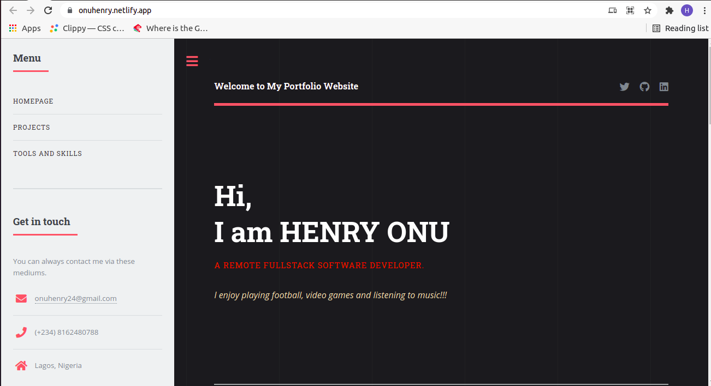
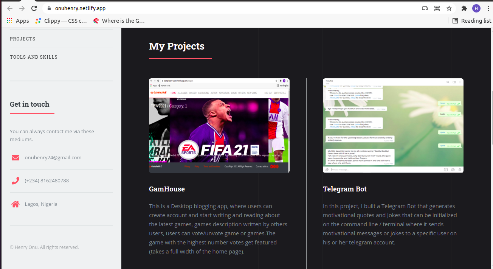

# Personal-Portfolio-Website
In this project, I built my Portfolio Website which is fully responsive

## Built With 🧰

- HTML
- CSS
- SASS
- Javascript

## Live Demo 🔴

[Live Demo Link](https://onuhenry.netlify.app/)

## Getting Started 🏁

To get a local copy up and running, follow these simple example steps.

### Prerequisites

If you can view this README.md file using a computer or a mobile phone with a browser and a good internet connection, congratulations! You have all the prerequisites to access our project.

### Setup

1. Open Terminal
2. Navigate to your desired location to download the contents of this repository.
3. Copy and paste the following code into the Terminal: 
        
        git clone https://github.com/Henryhaulka/Personal-Portfolio

4. Hit enter
5. Once the repository has been clone, open index.html in a browser of your choosing.
6. Enjoy!

## Author

👤 **HENRY ONU**

- GitHub: [@githubhandle](https://github.com/Henryhaulka)
- Twitter: [@twitterhandle](https://twitter.com/ONUHENRY12)
- LinkedIn: [LinkedIn](https://www.linkedin.com/in/henry-onu)

## 🤝 Contributing

The best contribution you can make is helping us improve our work by submitting an issue. 
Feel free to check the [issues page](https://github.com/Henryhaulka/Personal-Portfolio/).

You can also fork this repo and work on it.

## Show your support

Give a ⭐️ if you like this project!
